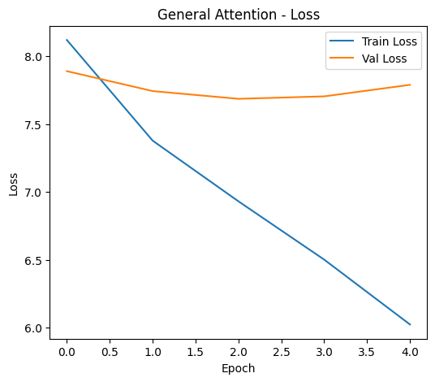
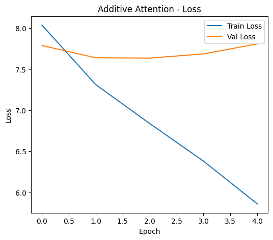
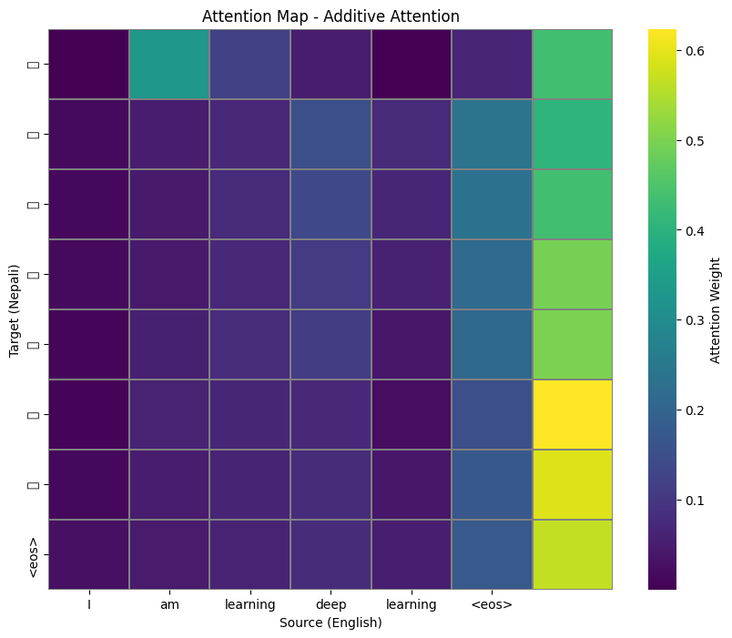
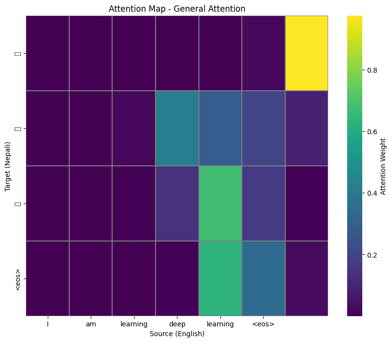

# A3: Make Your Own Machine Translation Language

# English to Nepali Translation

## Assignment Overview

This assignment implements a **Sequence-to-Sequence (Seq2Seq) Neural Machine Translation model** built from scratch to translate English text into Nepali. The model leverages **Attention mechanisms** to improve translation quality by learning word-level alignments between source and target sentences.

Two attention approaches are implemented and compared:

* **General Attention**
* **Additive Attention**

The assignment also includes an interactive **Dash web application** that allows users to input English text, view translated Nepali output, and visualize attention weights through heatmaps.

## Key Features

* **Model Architecture**: Encoder–Decoder Seq2Seq model implemented in PyTorch with configurable attention mechanisms.
* **Attention Mechanisms**:

  * *General Attention*: Uses dot-product–based alignment scoring.
  * *Additive Attention*: Uses a learned feedforward network to compute alignment scores.

* **Dataset**: English–Nepali parallel corpus sourced from the Hugging Face `datasets` library.
* **Training Visualization**: Real-time plots of training loss and perplexity.
* **Web App**: A Dash-based interface for translation and attention heatmap visualization.

## Follow these steps to run the application

### Install Dependencies

pip install torch torchvision torchaudio
pip install dash plotly pandas matplotlib seaborn datasets

### Run the Application

Navigate to the project folder and run:

python app.py

### Access the Interface

Open your web browser and go to:

http://127.0.0.1:8050/


## How to Use

1. Enter an English sentence into the input text box.
2. Click the **Translate** button.
3. The app will display:

   * The translated Nepali sentence.
   * An attention heatmap showing word alignments.
4. Compare how different attention mechanisms focus on source words during translation.

## File Structure

```
├── app.py                       # Dash web application
├── main.ipynb         # Model training and evaluation notebook
├── Additive_Attention-model.pt  # Saved trained model weights
├── General_Attention-model.pt   # Saved trained model weights
├── src_vocab.pkl                # English vocabulary
├── trg_vocab.pkl                # Nepali vocabulary
└── README.md                    # Project documentation
```

## Performance Summary

Both attention mechanisms were evaluated on validation data.

| Attention Mechanism | Training Loss | Training PPL | Validation Loss | Validation PPL |
| ------------------- | ------------- | ------------ | --------------- | -------------- |
| General Attention   | [6.023]      | [412.906]     | [7.789]        | [2412.939]       |
| Additive Attention  | [5.859]      | [350.430]     | [7.809]        | [2462.271]       |

Additive Attention generally converged faster and produced better alignments for complex grammatical differences between English (SVO) and Nepali (SOV).

## Learning Curves



## Attention Visualization

The attention heatmap provides insight into how the model aligns words during translation.

* X-axis: English source words
* Y-axis: Generated Nepali words
* Color intensity: Strength of attention weight




## Credits & References

* Dataset: sharad461/ne-en-parallel-208k (Hugging Face)
* References:

  * Bahdanau et al., *Neural Machine Translation by Jointly Learning to Align and Translate*
  * Luong et al., *Effective Approaches to Attention-based Neural Machine Translation*


