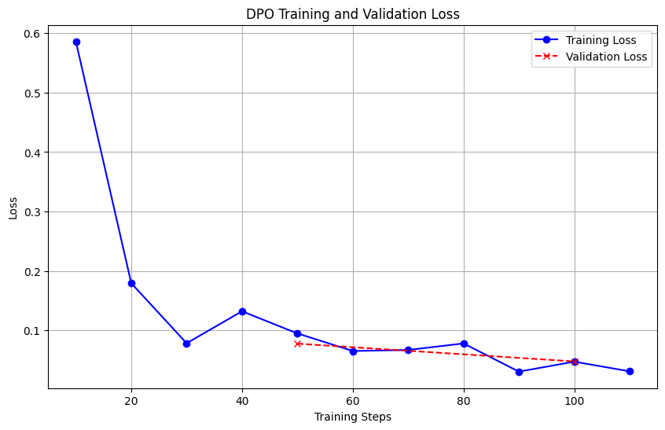

# Assignment 5: Optimization Human Preference & LLM-as-a-Judge 

## Project Overview
This repository contains the implementation for Assignment 5, focusing on Large Language Model (LLM) alignment and evaluation. The project involves fine-tuning a base instruction model (`Qwen/Qwen2.5-0.5B-Instruct`) using **Direct Preference Optimization (DPO)** to improve factuality and reduce hallucinations. Following the training, the model is evaluated against the base model using an automated **LLM-as-a-Judge** pipeline powered by the Gemini API.

---

## Tasks Breakdown & Implementation

### Task 1: Dataset Preparation
* **Dataset Used:** `jondurbin/truthy-dpo-v0.1`
* **Description:** This dataset contains prompts alongside `chosen` (factual/truthful) and `rejected` (hallucinated/incorrect) responses. It is specifically designed for preference optimization to teach the model to favor accurate information.

### Task 2: Training with DPOTrainer (QLoRA)
Due to hardware constraints, the model was quantized to 4-bit precision, and LoRA adapters were attached to the attention and feed-forward layers (`q_proj`, `k_proj`, `v_proj`, `o_proj`, `gate_proj`, `up_proj`, `down_proj`). 

**Training Hyperparameters:**
* **Epochs:** 1
* **Learning Rate:** 5e-5
* **Batch Size:** 2 (with Gradient Accumulation Steps = 4, effective batch size = 8)
* **Precision:** `bfloat16`
* **Beta (DPO Penalty):** 0.1
* **Max Length:** 512

### Task 3: Hugging Face Model Hub
The fine-tuned DPO model with its LoRA adapters merged has been successfully pushed to the Hugging Face Hub.
* **Model Link:** [https://huggingface.co/Tisa99/Assignment5-Qwen-DPO](https://huggingface.co/Tisa99/Assignment5-Qwen-DPO)

### Task 4: Evaluation (LLM-as-a-Judge)
To evaluate the success of the alignment, we used the `tatsu-lab/alpaca_eval` benchmark (`helpful_base` subset). 15 random prompts were sampled, and responses were generated by both the Base Model (Model A) and the fine-tuned DPO Model (Model B). 

**Judge:** `gemini-2.5-flash` (via Google GenAI SDK, `temperature=0.0`)

#### Evaluation Results
* **Total Model A (Base) Wins:** 9
* **Total Model B (DPO) Wins:** 6
* **Total Ties:** 0
* **Model B Win Rate:** 40.00%

#### Discussion & Insights
Based on the LLM-as-a-Judge evaluation, the DPO training did not improve the model's performance on the AlpacaEval benchmark. The Base model won 60% of the matchups. However, this outcome highlights several critical concepts in LLM alignment:

1.  **Dataset Mismatch (Truthfulness vs. Helpfulness):** The DPO training utilized the `truthy-dpo-v0.1` dataset, optimizing strictly for factual accuracy and penalizing hallucinations. Conversely, the `AlpacaEval` dataset evaluates models based on general helpfulness and expansiveness. The model was aligned for one objective but tested on another.
2.  **The Alignment Tax & Refusal Mode:** By optimizing strictly for truthfulness, the DPO model developed an "alignment tax." It became overly cautious. When asked simple, creative, or casual questions, the DPO model frequently resorted to standard AI disclaimers (e.g., *"As an artificial intelligence, I don't have a..."*) rather than providing an expansive answer. The Gemini judge penalized these refusals because they are less "helpful" to the user.
3.  **Compute Constraints:** The model was trained using 4-bit QLoRA for only a single epoch with a highly restricted batch size to prevent Out of Memory (OOM) errors. Effective preference alignment usually requires extensive hyperparameter tuning and longer training runs to ensure the model doesn't "forget" its base conversational abilities while learning new preferences.

**Conclusion:** The experiment successfully demonstrates that while preference optimization can quickly alter a model's behavior (making it highly cautious/factual), doing so without degrading its general conversational helpfulness requires careful, multi-objective dataset balancing.

---

## How to Run
1. Clone this repository.
2. Create a virtual environment and install the requirements:
   pip install torch transformers datasets trl peft bitsandbytes accelerate huggingface_hub pandas google-genai